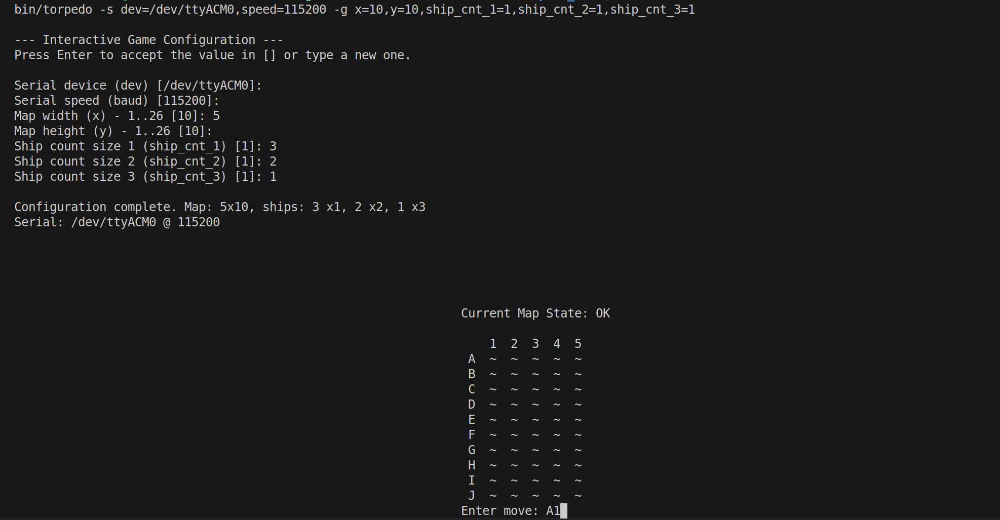

# Torpedó Játék (Battleship) - Beágyazott Linux és platformjai - BMEVIMIAC19 2025/26/1

Egy klasszikus torpedó (battleship) játék implementációja, amely egy **PC (Linux)** és egy **SiliconLabs xG24 Explorer** board közötti soros kommunikáción alapul.




---

## Szerzők

| Név | Neptun | GitHub |
|:---:|:------:|:------:|
| **Csuta Krisztián** | A6VRRM | [@krisztiancsuta](https://github.com/krisztiancsuta) |
| **Bódi Vencel** | VBW5N9 | [@bvencl](https://github.com/bvencl) |

---

## Tartalomjegyzék

- [Áttekintés](#áttekintés)
- [Architektúra](#architektúra)
- [Játékmenet](#játékmenet)
- [Telepítés és Használat](#telepítés-és-használat)
- [Parancssori Argumentumok](#parancssori-argumentumok)
- [Fejlesztői Dokumentáció](#fejlesztői-dokumentáció)
- [Projekt Struktúra](#projekt-struktúra)

---

## Áttekintés

A játék lényege, hogy a játékos a PC-n keresztül próbálja eltalálni az board által véletlenszerűen elhelyezett hajókat egy N×M méretű táblán. A kommunikáció **UART soros porton** keresztül történik.

### Főbb jellemzők:

- Változtatható táblaméret (max. 26×26)
- Konfigurálható hajószám (1, 2 és 3 egység hosszú hajók)
- Valós idejű terminál alapú felhasználói felület
- Játéknapló (game log) automatikus mentése
- Statisztikák követése (találatok, mellélövések, pontosság)

---

## Architektúra

A rendszer két fő komponensből áll:

```palin
┌─────────────────────┐         UART          ┌─────────────────────┐
│                     │  ◄──────────────────► │                     │
│   PC (Linux/C)      │    /dev/ttyACM*       │   Board (host)      │
│   - Felhasználói    │    115200 baud        │   - Játéklogika     │
│     felület         │                       │   - Hajóelhelyezés  │
│   - Input kezelés   │                       │   - Találat ellenőr.│
│   - Napló mentés    │                       │   - Térkép tárolás  │
│                     │                       │                     │
└─────────────────────┘                       └─────────────────────┘
```

### PC oldal (Kliens)

- **Nyelv:** C (Linux)
- **Feladatok:**
  - Felhasználói bemenet fogadása
  - Soros kommunikáció kezelése
  - Térkép megjelenítése terminálban
  - Játéknapló mentése fájlba

### Arduino oldal (Szerver/Host)

- **Nyelv:** Arduino C++
- **Feladatok:**
  - Hajók véletlenszerű elhelyezése
  - Lövések kiértékelése (HIT/MISS)
  - Játékállapot kezelése
  - Térkép küldése a kliensnek

---

## Játékmenet

### 1. Játék indítása

A PC elküldi a `Start` parancsot a konfigurációval:

```bash
Start <szélesség> <magasság> <1-es_hajók> <2-es_hajók> <3-as_hajók>
```


### 2. Kézi paraméterezés

A játék menüjében kézzel is beállíthatók az indítási paraméterek (pl. tábla szélessége/magassága, 1/2/3 egység hosszú hajók száma). A menüben megadott értékek felülírják a parancssori argumentumokban található alapértelmezéseket; ha egy mezőt üresen hagysz, a program a parancssori beállítást vagy a beépített alapértelmezést használja. A változtatások érvénybe lépnek a Start parancs elindításakor.


### 3. Hajók elhelyezése

A board véletlenszerűen elhelyezi a hajókat a táblán (vízszintesen vagy függőlegesen).

### 4. Játékciklus

```plain
┌──────────────────────────────────────────────────────────┐
│                                                          │
│  ┌──► Játékos beír egy koordinátát (pl. "A3")            │
│  │                                                       │
│  │    PC elküldi a koordinátát az Arduino-nak            │
│  │                                                       │
│  │    Arduino kiértékeli:                                │
│  │    ├── HIT!           → Hajó eltalálva                │
│  │    ├── MISS!          → Mellélövés                    │
│  │    ├── ALREADY TRIED! → Már lőtt ide                  │
│  │    ├── INVALID!       → Érvénytelen koordináta        │
│  │    └── GAME OVER      → Minden hajó elsüllyedt        │
│  │                                                       │
│  │    Arduino visszaküldi a frissített térképet          │
│  │                                                       │
│  └──◄ PC megjeleníti a térképet és az eredményt          │
│                                                          │
└──────────────────────────────────────────────────────────┘
```

### 5. Térkép jelölések

| Karakter | Jelentés |
|----------|----------|
| `~` | Ismeretlen mező (víz vagy hajó) |
| `x` | Eltalált hajó |

### 6. Játék vége

- **Győzelem:** Minden hajó elsüllyedt (`GAME OVER`)
- **Kilépés:** `x`, `quit`, vagy `exit` parancs (+ `RESET` küldése az Board-nak)

---

## Telepítés és Használat

### Előfeltételek

- Linux operációs rendszer
- GCC fordító
- Arduino IDE (host.ino feltöltéséhez)
- USB kábel az Arduino csatlakoztatásához

### Fordítás

```bash
# Projekt klónozása
git clone https://github.com/krisztiancsuta/Torpedo_hazi.git
cd Torpedo_hazi

# Fordítás
make

# Vagy debug verzió (extra kiírásokkal)
make debug

# Vagy optimalizált release verzió
make release
```

### Arduino feltöltése

1. Nyisd meg a `host.ino` fájlt az Arduino IDE-ben
2. Válaszd ki a megfelelő portot és boardot
3. Töltsd fel a kódot az Board-ra

### Futtatás

```bash
# Alapértelmezett beállításokkal
make run

# Vagy kézzel megadott paraméterekkel
./bin/torpedo -s dev=/dev/ttyACM*,speed=115200 -g x=10,y=5,ship_cnt_1=2,ship_cnt_2=3,ship_cnt_3=1
```

---

## Parancssori Argumentumok

### Soros port beállítások (`-s`)

| Paraméter | Leírás | Példa |
|-----------|--------|-------|
| `dev` | Soros port eszköz | `/dev/ttyACM*` |
| `speed` | Baudrate | `115200` |

### Játék beállítások (`-g`)

| Paraméter | Leírás | Alapértelmezett |
|-----------|--------|-----------------|
| `x` | Tábla szélessége (oszlopok) | - |
| `y` | Tábla magassága (sorok) | - |
| `ship_cnt_1` | 1 egység hosszú hajók száma | - |
| `ship_cnt_2` | 2 egység hosszú hajók száma | - |
| `ship_cnt_3` | 3 egység hosszú hajók száma | - |

### Példák

```bash
# 10x10 tábla, 3 db 1-es, 2 db 2-es, 1 db 3-as hajó
./bin/torpedo -s dev=/dev/ttyACM*,speed=115200 -g x=10,y=10,ship_cnt_1=3,ship_cnt_2=2,ship_cnt_3=1

# Kis tábla teszteléshez
./bin/torpedo -s dev=/dev/ttyACM*,speed=115200 -g x=5,y=5,ship_cnt_1=1,ship_cnt_2=1,ship_cnt_3=0

# Súgó megjelenítése
./bin/torpedo -h
```

---

## Fejlesztői Dokumentáció

### Makefile parancsok

| Parancs | Leírás |
|---------|--------|
| `make` | Projekt fordítása |
| `make debug` | Debug verzió fordítása (`-DDEBUG` flag) |
| `make release` | Optimalizált verzió (`-O2`) |
| `make clean` | Build fájlok törlése |
| `make distclean` | Minden generált fájl törlése |
| `make run` | Fordítás és futtatás |
| `make install` | Telepítés `/usr/local/bin`-be |
| `make help` | Súgó megjelenítése |

### Játéknapló

Minden játék automatikusan mentésre kerül a `gamelogs/` mappába időbélyeges fájlnévvel:

**Fájlnév formátum:** `game_YYYY-MM-DD_HHMMSS.txt`

**Példa tartalom:**

```log
=== TORPEDO GAME LOG ===
Date: 2025-11-30 21:32:27
Board size: 10x5
Ships: 2x1, 3x2, 1x3

--- MOVES ---
1. A1 - MISS!
2. A5 - HIT!
3. B3 - MISS!
...
50. E9 - GAME OVER

--- SUMMARY ---
Total moves: 50
Hits: 11
Misses: 38
Accuracy: 22.00%
Result: WIN
```

### Kommunikációs Protokoll

**PC → Arduino:**

| Üzenet | Leírás |
|--------|--------|
| `Start X Y S1 S2 S3\n` | Játék indítása paraméterekkel |
| `A3\n` | Lövés az A3 mezőre |
| `RESET\n` | Játék megszakítása |

**Arduino → PC:**

| Üzenet | Leírás |
|--------|--------|
| `OK` | Start parancs elfogadva |
| `HIT!` | Találat |
| `MISS!` | Mellélövés |
| `ALREADY TRIED!` | Már próbált mező |
| `INVALID!` | Érvénytelen koordináta |
| `GAME OVER` | Játék vége (győzelem) |
| `MAP`...`END` | Térkép adatok |

---

## Projekt Struktúra

```plain
Torpedo_hazi/
├── src/
│   ├── main.c          # Belépési pont
│   ├── arguments.c/h   # Parancssori argumentumok kezelése
│   ├── baudrate.c/h    # Baudrate konverziók
│   ├── serial.c/h      # Soros port kezelés (termios)
│   ├── game.c/h        # Játéklogika, UI, napló
│   └── settings.txt    # Alapértelmezett beállítások
├── bin/
│   └── torpedo         # Lefordított futtatható
├── build/
│   └── *.o             # Object fájlok
├── gamelogs/
│   └── game_*.txt      # Játéknaplók
├── host.ino            # Arduino kód
├── Makefile            # Build rendszer
└── README.md           # Ez a fájl
```

### Forrásfájlok leírása

| Fájl | Leírás |
|------|--------|
| `main.c` | Program belépési pontja, inicializálás |
| `arguments.c` | `getopt` és `getsubopt` alapú argumentum feldolgozás |
| `baudrate.c` | Numerikus baudrate → termios konstans konverzió |
| `serial.c` | Soros port megnyitása és konfigurálása |
| `game.c` | Játék fő logikája: `poll()` alapú I/O multiplexelés, térkép kirajzolás ANSI escape kódokkal, napló mentés |
| `host.ino` | Arduino szerver: hajóelhelyezés, találat kiértékelés |

---

## Licensz

Ez a projekt oktatási célokra készült.
